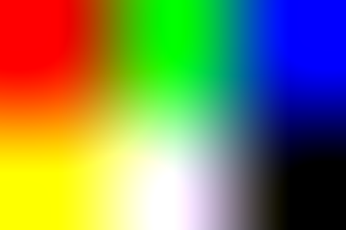
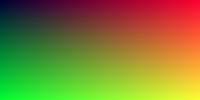
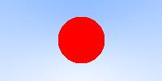
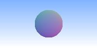
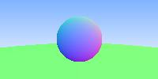
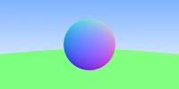
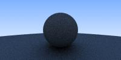
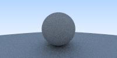

# Raytracer

This project is my reimplementation of the [Raytracing in One Weekend](https://raytracing.github.io/books/RayTracingInOneWeekend.html) course.

**Table Of Contents.**
- [Build](#compile--run)
- [Usage](#usage)
- [Links](#links)
- [Results](#results)

## Build

This project was developed and tested unter the *Windos-Subsystem for Linux* ([wsl](https://learn.microsoft.com/en-us/windows/wsl/about)).

Building the project requires a `c++` compiler and`make`. These dependencies can be installed as follows:

```
# apt install build-essential
```

The project can then be build as follows:

```
$ make
```

## Usage

To run the raytracer and store the result as `image.ppm`, issue the following command:
```
$ raytracer > image.ppm
```

The resulting image is stored as a [Portable Pixelmap (PPM)](https://de.wikipedia.org/wiki/Portable_Anymap#Pixmap). I used the [PPM View Extension](https://marketplace.visualstudio.com/items?itemName=jtlehtinen.vscode-ppm-view) for VS Code to display the resulting images. Alternatively, the `/images` folder contains a script for converting the `*.ppm` images in that folder to `*.jpg`. Simply copy the `*.ppm` image into that folder and run the conversion script:
```
$ cp image.ppm images/image.ppm
$ cd images
$ ./convert_to_jpg.sh
```

The images in the [results](#results) where also generated using this script.

## Links

- Original project [github](https://github.com/petershirley/raytracinginoneweekend)
- Original project [homepage](https://in1weekend.blogspot.com/)

## Results

**Understanding PPM.**
We use the [Portable Pixelmap (PPM)](https://de.wikipedia.org/wiki/Portable_Anymap#Pixmap) to render the resulting images. To understand the file format, we generated this image manually. It is a 3x2 pixel image with hardcoded color values.

<!--
    This image needs to be displayed via the html <image>-tag, as we need to scale it so it is visible (it is only 3x2 pixels large).
-->


**First Generated Image.** To generate large images in code, we implemented the `Image` and `PortablePixelmap` classes. This image was generated when testing these classes. It blends colors by increasing the red component from left to right and the green component from top to bottom. Thus the top-left contains neither red nor green, the top right corner contains only red, the bottom left corner contains only green and the bottom right corner contains both red and green (resulting in yellow).



**Rendering a Sphere.** And showing some love for japan ;). To render a `Sphere`, we implement a `Ray` class (a ray has an origin and a direction). We use a camera as the origin and shoot our rays through the pixels of the image. If the ray collides with the circle, it is rendered in red, otherwise we blend white with a light blue to create a background sky.



**Adding Depth.** When hitting the sphere we compute the dot-product of the incoming ray with the surface normal of the sphere to implement a primitive version of shading.



**Multiple Objects.** To implement multiple objects we create the `Hitable` interface. A sphere implements this interface. Additionally, we introduce a `HitableList`, to allow for multiple spheres. A ray now computes the closest object that it hits.



**Antialiasing.** To smooth out the edges, we shoot multiple rays through each pixel (by randomizing small offset in the x- and y-direction). The color of a pixel is determined by averaging the colors of all the rays for that pixel.



**Diffuse Materials.** To implement diffuse materials, we proceed as follows.

1. we compute the hitpoint of the ray with this material
2. we generate a new ray whose
   - origin is the hitpoint and
   - direction is computed by a random point on the unit circle around the hitpoint
3. we trace that ray and compute its resulting color.

Note the shadow below the sphere. It is a bit difficult to spot on this image but becomes much more visible on the next image where we add gamma correction.



**Gamma-Correction.** The diffuse image is very dark, as it is not yet gamma corrected. We implement a gamme correction by computing the square-root of the color values.

